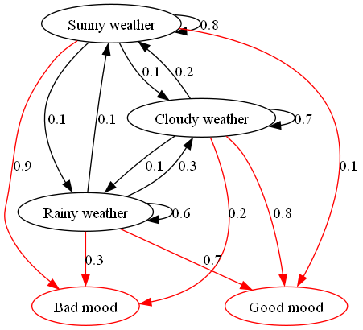

# numpy-markov-model

This repository contains implementations of Markov Model (MM) and Hidden Markov Model (HMM) in Python using the NumPy library.

## Markov Model (MM)

### Example usage:
```python
import numpy as np
import re
import sys
sys.path.append(".")

from src.mm import MarkovModel


# Example usage 1

#Prepare data
with open("src/data/model-speech.txt", 'r') as f:
    corpus = f.read()
    
corpus = corpus.replace('\n', ' ').lower()
corpus = re.sub(r'[,.\"\'!@#$%^&*(){}?/;`~:<>+=-\\]', '', corpus)

corpus_elems = corpus.split(" ")
unique_elems = list(set(corpus_elems))

n_unique_elems = len(unique_elems)


#Initialize Markov model
nlp_mm = MarkovModel()

#Train Markov model
nlp_mm.train(corpus_elems)

#Sample
sequence = ' '.join(nlp_mm.sample(15, current_state='users'))

print(sequence)
#>>> users know what was able to note i want to be just primitive hints of
```

```python
# Example usage 2
transition_matrix = np.array([[0.2, 0.6, 0.2], [0.3, 0, 0.7], [0.5, 0, 0.5]])
mm = MarkovModel(
    states = ['State 1', 'State 2', 'State 3'], 
    transition_matrix=transition_matrix
)

print(mm.sample(n_steps = 5))
print(mm.stationary_distribution())

mm.render()
```

## Hidden Markov Model (HMM)

Includes algorithms:    
1. Forward-Backward        
2. Viterbi     
3. Baum-Welch      

### Example usage:
```python
import numpy as np
import sys
sys.path.append(".")

from src.hmm import HiddenMarkovModel

# Example usage
# Define your transition matrix, emission matrix, initial probabilities, states, and observations

transition_matrix = np.array([[0.8, 0.1, 0.1], [0.2, 0.7, 0.1], [0.1, 0.3, 0.6]])
emission_matrix = np.array([[0.9, 0.1], [0.2, 0.8], [0.3, 0.7]])
initial_probabilities = np.array([0.4, 0.3, 0.3])

hmm = HiddenMarkovModel(
    transition_matrix, 
    emission_matrix, 
    initial_probabilities, 
    states=["Sunny weather", "Cloudy weather", "Rainy weather"], 
    observations=["Bad mood", "Good mood"]
)
hmm.render()

sequence, observations = hmm.sample(n_steps=5)
print("Generated sequence of states:\n", observations)

state_sequence, posterior = hmm.forward_backward(sequence)
print("Restoring the most probable sequence of states via 'forward-backward':\n", state_sequence)
print(posterior)

state_sequence = hmm.viterbi(sequence)
print("Restoring the most probable sequence of states via 'viterbi':\n", state_sequence)

# Perform the Baum-Welch algorithm on the given observation sequence
hmm.baum_welch(sequence, n_iterations=10)

# Updated parameters after running the Baum-Welch algorithm
print("Updated Transition Matrix:\n", hmm.transition_matrix)
print("Updated Emission Matrix:\n", hmm.emission_matrix)
print("Updated Initial Probabilities:\n", hmm.initial_probabilities)

print("Stationary Distribution\n:", hmm.stationary_distribution())
```

### Render via Graphviz (should installed separately):
<p align="center">

</p>